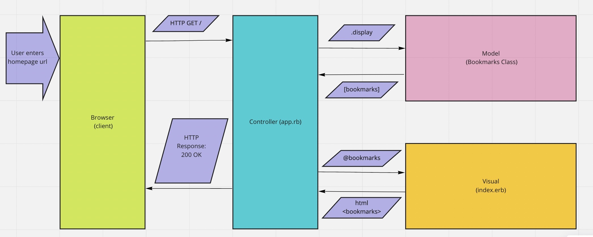

# Specifications & Corresponding User Stories
1. Show a list of bookmarks:
As a web surfer,
So that I can save time,
I'd like to see a list of bookmarked pages

### Example Domain model

*The final system design ended up varying from this original model*

2. Add new bookmarks:
As a web surfer,
So that I can quickly access interesting sites,
I'd like to add new bookmarks

3. Delete bookmarks:
As a web surfer,
So that I can reduce clutter and confusion,
I'd like to delete bookmarks I no longer need

3. Update bookmarks:
As a web surfer,
So that I can correct errors and improve organisation,
I'd like to update existing bookmarks

4. Show a list of bookmark comments:
As a web surfer,
So that I can decide if I would like to visit a website,
I'd like to see a list of bookmark comments

5. Add bookmark comments:
As a web surfer,
So that I can record important points about a website
I'd like to add comments to bookmarks 

6. Users manage their bookmarks:
As a web surfer,
So that I can organize my bookmarks
I'd like to add tags to bookmarks 

#Database Setup
---------------

##Bookmarks - PROD
1. Connect to psql:
"psql"
2. Create the database using the psql command:
"CREATE DATABASE bookmark_manager;"
3. Connect to the database using the pqsl command:
"\c bookmark_manager;"
4. Run the query we have saved in the file 01_create_bookmarks_table.sql:
"CREATE TABLE bookmarks(id SERIAL PRIMARY KEY, url VARCHAR(60), title VARCHAR(60));"
5. Insert rows into table with sql queries (examples):
"INSERT INTO bookmarks (url, title) VALUES ('http://www.makersacademy.com', 'makers');"
"INSERT INTO bookmarks (url, title) VALUES('http://www.destroyallsoftware.com', 'destroyallsoftware');"
"INSERT INTO bookmarks (url, title) VALUES('http://www.google.com', 'google');" 

##Bookmarks - TEST
1. Connect to psql:
"psql"
2. Create the database using the psql command:
"CREATE DATABASE bookmark_manager_test;"
3. Connect to the database using the pqsl command:
"\c bookmark_manager_test;"
4. A 'bookmarks' table is constructes/deconstructed before/after each test using methods in:
spec/construct_test_database.rb
spec/deconstruct_test_database.rb
*These methods are called in spec_helper.rb within the RSPEC.configure section*

##Comments - PROD
1. Connect to psql:
"psql"
2. Create the database using the psql command:
"CREATE DATABASE bookmark_manager;"
3. Connect to the database using the pqsl command:
"\c bookmark_manager;"
4. Run the query we have saved in the file 01_create_bookmarks_table.sql:
CREATE TABLE comments(id SERIAL PRIMARY KEY, text VARCHAR(240), bookmark_id INTEGER REFERENCES bookmarks (id));
5. Insert rows into table with sql queries (examples):
INSERT INTO comments (text, bookmark_id) VALUES ('great for learning quickly', '1');
INSERT INTO comments (text, bookmark_id) VALUES('very entertaining', '2');
INSERT INTO comments (text, bookmark_id) VALUES('informative and conveninent', '3');
INSERT INTO comments (text, bookmark_id) VALUES('intense study', '1');

##Comments - TEST
1. Connect to psql:
"psql"
2. Create the database using the psql command:
"CREATE DATABASE bookmark_manager_test;"
3. Connect to the database using the pqsl command:
"\c bookmark_manager_test;"
4. A 'bookmarks' table is constructes/deconstructed before/after each test using methods in:
spec/construct_test_database.rb
spec/deconstruct_test_database.rb
*These methods are called in spec_helper.rb within the RSPEC.configure section*

